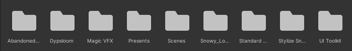
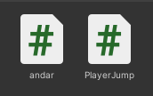

# unity.2bim
Esse é um projeto solicitado pela Orientadora Aline Firmino, com o objetivo de aprender a usar assets, scripts e fisica em uma cena no Unity.

## Requisitos 
Para ver essa cena é necessario o Unity com a versão 2022.2.15f1

## Instalação 
1. Clonar o projeto `https://github.com/Gabriele-sousa/unity.2bim.git`.
2. Abrir o projeto no Unity.

## Desenvolvimento
Para criar esse projeto foram utilizados os seguintes passos:
1. Baixar assets na asset store.
* Esses foram os assets baixados para o projeto
 
2. Colocar os game objects na cena.
 * Para a cena foi adicionados Arvores, Presentes, Bonecos de neve e Obstáculos.
 
 * Colocar o personagem que irá receber os scripts e a camera dentro da pasta do personagem
 
3.Criar os scripts e programar
 * Foram criados dois scripts 
 
 
 * Para fazer o Pinguim andar no script foi adicionado `if (Input.getKey (KeyCode.W))` e `transform.Translate (0.0f, 0f, 0.01f);` e para o fazer andar pra frente e o mesmo código mas com o `(KeyCode.S)` e o `transform.Translate (0.0f, 0, -0.01f);`.
 * Para fazer o Pinguim olhar para o lado foi adicionado `if (Input.getKey (KeyCode.D))` e `transform.Rotate (0.0f, 0.2f, 0f);` e para fazer o pinguim olhar pro outro lado `if (Input.getKey (KeyCode.A))` e o `transform.Rotate (0.0f, 0.2f, 0f);`.
 * O código final fica assim 
 
 
 * Para fazer o pinguim pular é um código mais difícil
 Primeiro requisitamos o componente RigidBody
